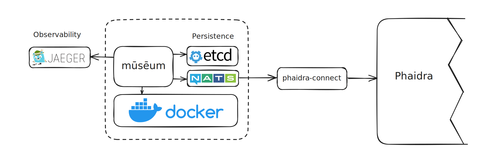

# Documentation

## What is museum?

mūsēum (/muːˈseː.um/) is a proxy server, orchestrator, and runtime designed to manage web applications efficiently. It enables the deployment and scaling of containerized applications, automatically adjusting resources to meet demand and scaling down to zero when idle. This approach optimizes resource utilization and reduces operational costs.

## Why museum?

mūsēum was developed at the University of Vienna to address specific challenges encountered in academic research environments. Knative, OpenFaaS, similar systems and custom operators were also evaluated but were already initially deemed as very complex.  Due to administrative policies, it was ultimately not possible to deploy Kubernetes, which necessitated the search for an alternative solution. Faced with these constraints, mūsēum was created as a standalone orchestrator that avoids the complexity and overhead of more traditional systems. The result is a streamlined, user-friendly solution that simplifies the deployment and management of containerized web applications.

## Terminology

* **mūsēum** or mūsēum server is the application itself. Usually, I refer to the entire orchestrator (so the server, NATS, etcd and all the observability tools) as mūsēum and the Go part as the server.
* **exhibits** are the actual applications provisioned by mūsēum. An exhibit can contain several containers and have metadata, storage and other config attached to it.
* **exhibit-files** are the config files that *describe* an exhibit.
* **leases** are the timeouts attached to exhibits. Whenever an exhibit is used, the lease gets renewed (i.e. the lease time in seconds gets added to the current unix time and is stored). If the lease is greater or equal to the current unix time, the exhibit is expired and will be cleaned up by the `ExhibitCleanupService`.

## Architecture

The architecture is relatively straightforward. For tracing mūsēum uses [Jaeger](https://www.jaegertracing.io) with [opentelemetry/otel](https://opentelemetry.io) internally. Persistent data is stored in [etcd](https://etcd.io) as it is a battle proven solution (used in K8s) with excellent pessimistic locking capabilities. [NATS](https://nats.io) is used for eventing (e.g. for EDD for external systems like Phaidra or for loading screens internally). As a container backend, mūsēum uses [docker](https://www.docker.com) (or rather [moby](https://mobyproject.org)), although this could be switched out for [containerd](https://containerd.io) or any other container runtime.

## Current status

- [ ] Scaling to >= 1 instances
- [ ] W3C conformant proxy rewrite engine
- [ ] WebSockets
- [ ] Longpolling
- [ ] SSE

### Stable

- [x] Creating exhibits
  - [x] Auto-pulling images
  - [x] Config validation
- [x] Deleting exhibits
- [x] Scaling from 0
- [x] Cleaning up "expired" exhibits
- [x] Attaching local volumes
- [x] Livechecks
- [x] Eventing
- [x] Tracing
- [x] Having multiple instances of museum

### Known issues

* SSE connection when spinning up new exhibits sometimes fails, leaving users in an infinite loop

* Proxy rewrite sometimes fails 

* Docker connection currently works in Swarm mode only

* Networking to docker is currently implemented by looking up the internal docker IP addresses, exposing a random port on machine and forwarding to it would be better

## How does museum work? - Overview

mūsēum can be described very simply. Whenever a request to an exhibit comes in, mūsēum will look up the current state of the exhibit and start it if the exhibit is in a stopped state. If the exhibit is in a started state, the request will simply be forwarded to it. Otherwise, a loading page will be served and mūsēum will try to provision the exhibit.

## Subsystems - Overview

mūsēum relies on 4 main subsystems that were all writtin from scratch for mūsēum.

- The [IoC container](./subsystems/ioc_container.md) is at the core of the application and is a fairly simple but powerful inversion of control container. It is responsible for registering all interfaces with their appropriate implementations and provisioning them to other implementations within the application enabling very fast iteration time due to the decoupled nature of this architecture.
- mūsēum has its own [HTTP Router](subsystems/router.md) to serve API endpoints, health probes and to proxy services. This was built because mūsēum needs to both match to specific paths (e.g. `POST /api/exhibit`) but also provide a proxy that can forward the "rest-path" to the proxied container (e.g. `GET /exhibit/908cf715-72e8-44c7-a48d-d552b7a43918/>>` will match every request that *starts* with the path before `>>`). Since no other HTTP library officially supports this (see for example [gin-gonic/#3715](https://github.com/gin-gonic/gin/issues/3715)), writing it from scratch seemed reasonable (especially because I only had to write the router part and not the actual server as that is of course provided by the Go stdlib).
- The [rewrite service](subsystems/rewrite_service.md) is actually not its own subsystem but is part of the `museum/service` package and is provisioned in the IoC container. Every request passes through the rewrite service which then modifies the HTTP messages by replacing the server URL with the URL of the mūsēum instance + `/exhibit/exhibit-id`. If a URL is given without the host portion (e.g. in `href` or `src` tags), the rewrite engine just prepends `/exhibit/exhibit-id`.
- Another important service, which technically isn't its own subsystem, is the [application provisioner service](subsystems/application_provisioner_service.md). As its name implies, it is responsible for handling the lifecycles of the underlying applications. As seen in the dependency graph, it is the biggest and most important service, talking to basically every other service to ensure safe concurrent deployment and deletion of applications. 

## Dependency graph

- **Dotted lines** indicate implementations
- **Full lines** indicate dependencies

